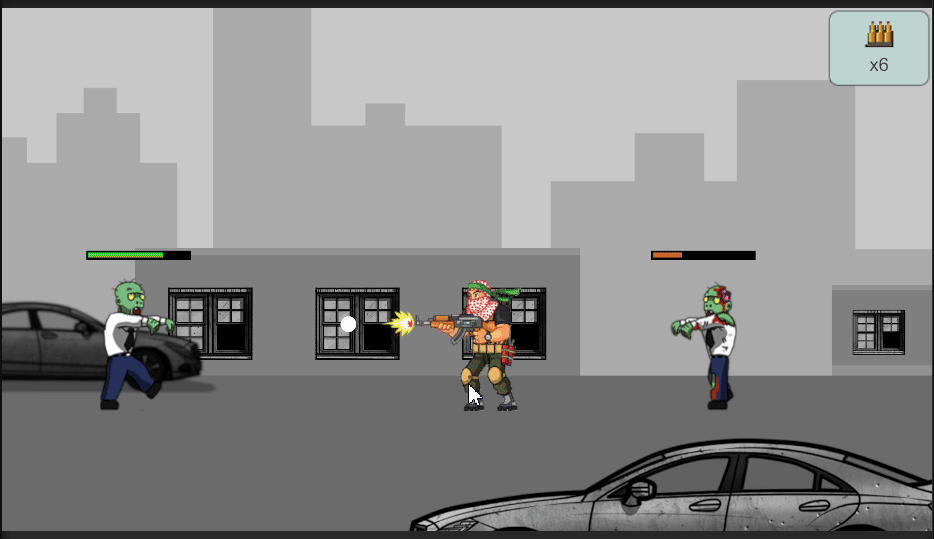

# Одномерный платформер на ECS

Одномерный платформер на **Leopotam.EcsLite** (ECS для Unity).  
Вся игровая логика реализована отдельными системами ECS, каждая отвечает только за свою зону ответственности.

## Ключевые элементы

- **Player** - управляемый игроком персонаж. Может двигаться влево-вправо и стрелять. Патроны заканчиваются.
- **Mob** - противники, периодически появляющиеся на сцене (согласно ТЗ с интервалом от 1 до 10 секунд). Двигаются на игрока. Могут быть 3 разных видов со своими характеристиками.
- **Bullet** - снаряды, выпускаемые игроком.
- **Muzzle** -  оружие, имеет свой настраиваемый конфиг. Отвечает за выпуск снарядов.
- **Loot** - выпадает после смерти мобов. В настоящей версии представлен только патронами для оружия. Мобы имеют шанс его выпадения в определенных количествах (у разных типов мобов по разному)
- **SceneEffect** - настраиваемые эффекты, которые могут содержать в себе партиклы и звуки, создаются на сцене по запросу.
- **Конфиги** - характеристики мобов, игрока, оружия и визуальных и звуковых эффектов представленны в отдельных конфигах, которые пробрасываются в ECS системы в виде компонентов, что позволяет придать игре расширяемость, возможность добавления новых предметов, мобов, калибровать геймплейный баланс.

## Основные ECS-системы

Системы отрабатывают каждый кадр в нижепредставленном порядке, что позволяет отработать все запросы, создаваемые системами нижнего уровня для отображения результата на сцене и в UI

| Система            | Описание                                    |
|--------------------|---------------------------------------------|
| **MobSpawnSystem** | Спавн врагов                                |
| **InputSystem**    | Управление игроком                          |
| **PlayerSystem**   | Логика игрока, стрельба                     |
| **MoveSystem**     | Движение всех объектов                      |
| **BulletSystem**   | Создание и удаление пуль                    |
| **CollisionSystem**| Обработка столкновений (кастомная)          |
| **DamageSystem**   | Применение урона                            |
| **ParallaxSystem** | Параллакс-эффекты для фона                  |
| **LootSystem**     | Управление лутом                            |
| **CheckFailSystem**| Проверка условий поражения                  |
| **EffectsSystem**  | Визуальные/звуковые эффекты                 |
| **UISystem**       | Синхронизация с UI                          |

## Архитектура

- **Собственно Entity-Component-System (ECS):** Архитектура разделяет данные, логику и сущности для гибкости и масштабируемости. Весь игровой цикл построен на последовательном вызове систем в том порядке, в каком они находятся в таблице.
- **Singleton:** Для хранения конфигов, пулов и глобальных сервисов. За счет кастомных расширений могут вызываться в системах "в одну строку" для лучшей читаемости кода.
- **Dependency Injection:** Зависимости и сервисы внедряются через компоненты-синглтоны (что видно на примере конфигов, которые однократно инъецированны на этапе EntryPoint и используются повсеместно в системах.
- **Observer:** Системы реагируют на появление событийных компонентов. При этом отработавшие сущности сигналов удаляются, после того, как они достигли конечного пункта.
- **Object pool:** Объекты, создаваемые в процессе игры также используют "пулинг" для деактивации отработавших объектов, чтобы использовать их по запросу заново, что при большом количестве объектов позитивно сказывается на производительности  

## Особенности

- Простое масштабирование: для новой логики - добавь систему, для новых визуальных эффектов или мобов - добавь новый конфиг
- Чистое разделение ответственности по ECS. Системы НЕ хранят в себе данные, а только работают с сущностями и их компонентами
- НЕ использовались дополнительные фреймворки
- НЕ используется физический движок Unity и коллайдеры, что уменьшает размер билда и производительность (для такого рода одномерных платформеров)

[WebGL билд](https://algiskhasanov.itch.io/platformer-ecs)
[PC билд в архиве](https://github.com/algiskh/Platformer_ECS/blob/main/)
